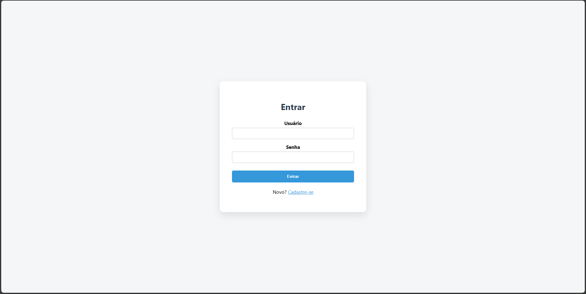
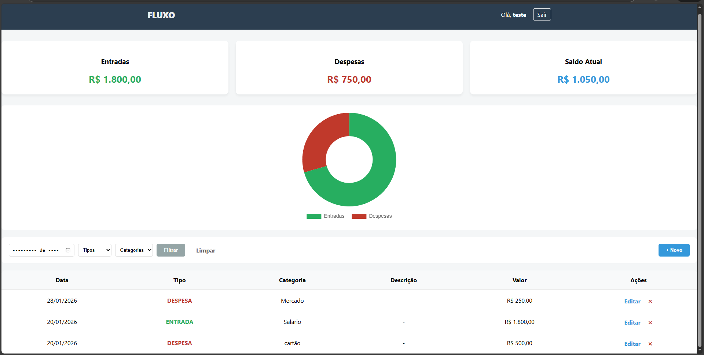
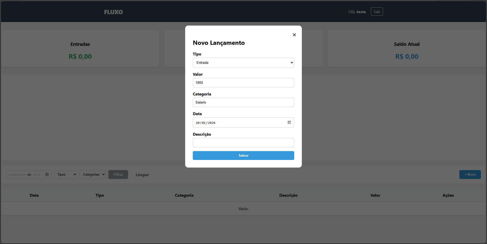
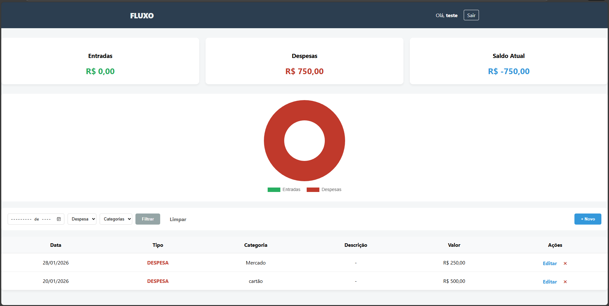

## Fluxo - App Financeiro

Sistema web para controle de finanças pessoais, permitindo cadastro de usuários e gerenciamento de entradas e despesas.

## Tecnologias utilizadas

- Python
- Flask
- MySQL
- HTML
- CSS
- JavaScript

## Funcionalidades

- Cadastro e login de usuários
- Registro de entradas e despesas
- Categorização de transações
- Listagem e edição de registros
- Banco de dados relacional com chave estrangeira

## Preview

### Tela de Login
<p align="center">
  
</p>

### Tela de Cadastro
<p align="center">
  
</p>

### Dashboard
<p align="center">
  
</p>

### Nova Transação
<p align="center">
  
</p>

### Histórico e Filtros
<p align="center">
  
</p>


## Como rodar o projeto

1. Clone o repositório:

```bash
git clone https://github.com/Jhony-Correa/Fluxo.git
```

2. Entre na pasta:

cd Fluxo


3. Instale as dependências:

pip install -r requirements.txt


4. Configure o arquivo .env:

Copie .env.example
Renomeie para .env
Preencha com suas credenciais

5. Execute:

python app.py

## Banco de Dados

O script de criação está em:
database/schema.sql

## Autor
Jhony Luis Ozório Corrêa